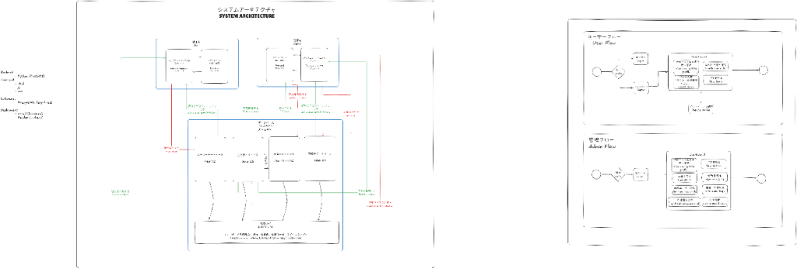

# Hospital Inventory Management System (IMS)

## Project Overview
This Hospital Inventory Management System is a comprehensive web application designed to streamline the tracking, ordering, and distribution of medical supplies (specimen containers, etc.) between clinical wards and hospital laboratories. 

The system provides a dual-interface approach:
1. **Admin Dashboard**: For laboratory staff to manage inventory, approve user accounts, track delivery personnel, and view system-wide analytics.
2. **Ward Portal**: For hospital ward staff to request containers, track request history, and manage their departmental profiles.

This project was developed as part of an internship program at Techno Project Japan Co. in Matsue, Japan.

## Key Features

### Core Functional Modules
*   **Inventory Management**: Real-time tracking of stock levels with low-stock alerts.
*   **Request & Order System**: Multi-item ordering process for ward staff with urgency prioritizing.
*   **Audit Logging**: Comprehensive tracking of system actions including logins, distribution events, and stock adjustments.
*   **User Management**: Secure account creation with administrative approval workflows for ward staff.
*   **Delivery Tracking**: Assignment of delivery personnel to outgoing requests with real-time status updates.

### Advanced Capabilities
*   **Analytics Dashboard**: Visual representation of inventory usage trends and ward-specific distribution.
*   **Data Export**: Integrated functionality to export audit logs to Microsoft Excel (.xlsx) format for external reporting.
*   **Internationalization (i18n)**: Support for English and Japanese languages throughout the interface.
*   **Responsive Design**: Optimized layout for both desktop and mobile devices, ensuring accessibility in various hospital environments.

## Technical Architecture

### System Architecture


### Backend
*   **Framework**: FastAPI (Python)
*   **Database**: Supabase (PostgreSQL)
*   **Authentication**: JWT-based secure session management with salted SHA-256 password hashing.
*   **API Pattern**: RESTful architecture for all crud operations and system logic.

### Frontend
*   **Interface**: Vanilla HTML5, CSS3, and JavaScript (ES6+).
*   **Analytics**: Chart.js for data visualization.
*   **Export**: SheetJS for client-side Excel file generation.
*   **Design**: Modern, high-performance UI components with a focus on usability and responsiveness.

## Project Structure
```text
IMS2.0/
├── backend/            # FastAPI source code and database models
│   ├── auth.py         # Security and JWT logic
│   ├── database.py     # Supabase connection configuration
│   ├── main.py         # Application routes and business logic
│   └── models.py       # Data schemas and validation
├── frontend/           # Client-side web interface
│   ├── admin.html      # Administrator interface
│   ├── user.html       # Ward staff interface
│   ├── style.css       # Unified design system
│   ├── i18n.js         # Internationalization strings
│   └── *.js            # Functional controller scripts
└── README.md           # Project documentation
```

## Setup and Installation

### Backend Requirements
1.  Python 3.9+
2.  Supabase Account and Project
3.  Dependencies: `fastapi`, `supabase`, `python-jose`, `passlib`, `uvicorn`, `pandas`, `openpyxl`

### Frontend Requirements
The frontend is built using standard web technologies and can be served using any static web server (e.g., Live Server, Nginx, or Apache).

## Development Context
This project represents a professional implementation of a modern inventory management workflow, emphasizing security, performance, and cross-cultural accessibility. It was created to demonstrate integrated full-stack development capabilities during my internship at Techno Project Japan Co., Matsue, Japan. 
